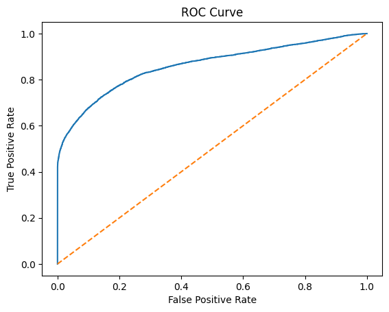

# loan-default-risk-analytics
## Project Overview
This project develops a credit risk classification model to predict loan default using historical borrower and loan-level data. The objective is to simulate a real-world financial risk analytics workflow, including exploratory analysis, feature engineering, model training, threshold optimization, and business interpretation.

## Business Objective
Financial institutions must balance risk control and loan approval efficiency. The goal of this project is to:
- Predict probability of loan default
- Identify key risk drivers
- Optimize decision threshold for improved risk capture
- Provide interpretable insights for credit policy decisions

## Dataset
- Source: Kaggle (Loan Default Dataset)
- Observations: ~148,000 loans
- Target variable: `Status` (1 = Default, 0 = Non-default)
- Default rate: ~24.6%

Key features include:
- Loan amount
- Credit score
- Loan-to-Value (LTV)
- Debt-to-Income ratio (DTI)
- Interest rate spread
- Income
- Credit type

## Data Preparation
- Removed ID and year fields
- Missing values imputed (median for numeric, mode for categorical)
- One-hot encoding applied to categorical variables
- Standard scaling applied before modeling
- Created engineered features:
  - Loan-to-income ratio
  - Risk interaction proxy (LTV × DTI)

## Modeling Approach
Baseline Model:
- Logistic Regression
- Train/test split (80/20)
- Standardized features

## Model Performance
Baseline threshold (0.5):
- Accuracy: 87%
- AUC: 0.86
- Precision (Default): 0.93
- Recall (Default): 0.51

Adjusted threshold (0.3):
- Recall improved to 0.65
- Precision reduced to 0.72
This demonstrates trade-off management between risk detection and false positives.
### ROC Curve

## Key Risk Driver
Top influential variables:
- Credit type (Equity-based loans)
- Loan-to-Value (LTV)
- Interest rate spread
- Income (negative relationship with default)
- Upfront charges

Higher LTV and certain credit structures significantly increase default probability.

## Business Insights
- Lowering decision threshold increases risk capture.
- LTV and income are strong predictors of default.
- Model AUC of 0.86 indicates strong discriminatory power.
- Suitable for risk-based pricing or loan approval policy support.

## Future Improvements
- Test ensemble models (Random Forest / XGBoost)
- Address class imbalance using SMOTE
- Calibrate probability outputs
- Deploy as scoring API

## Project Structure
```
loan-default-risk-analytics/
│
├── notebooks/
│   └── 01_eda_modeling.ipynb
│
├── README.md
│
└── .gitignore
```

## Author
Tianxiao He  
Applied Economics & Data Analytics
